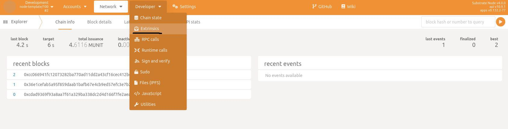
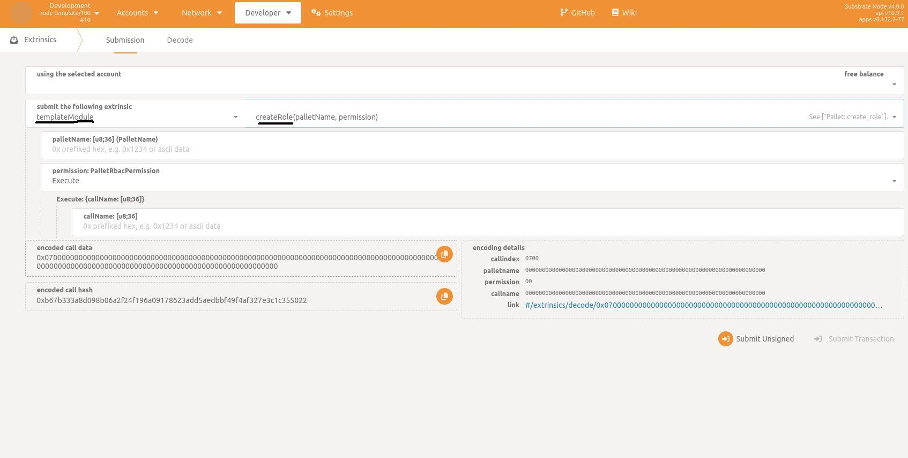
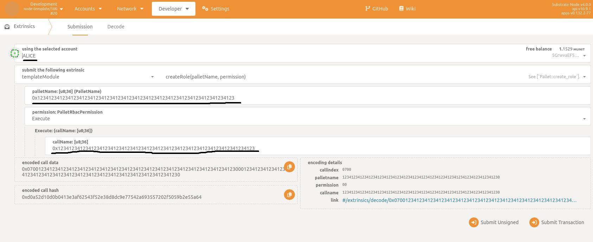
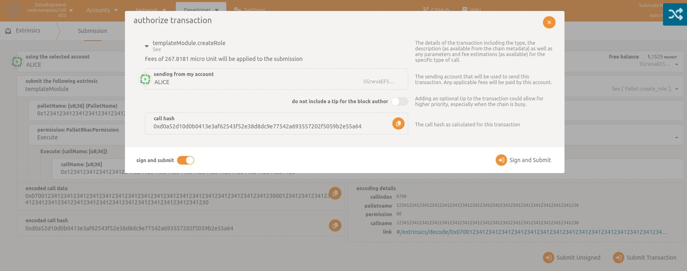
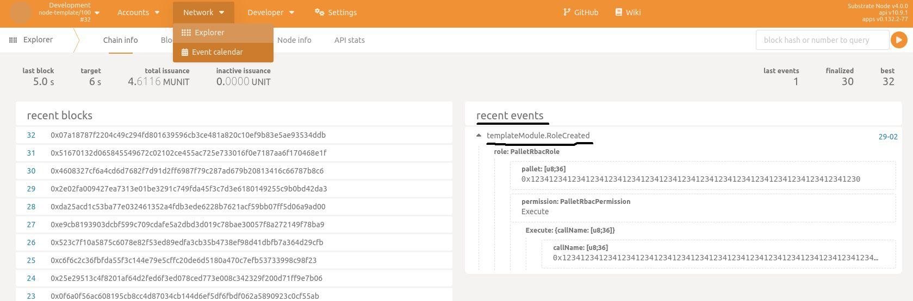
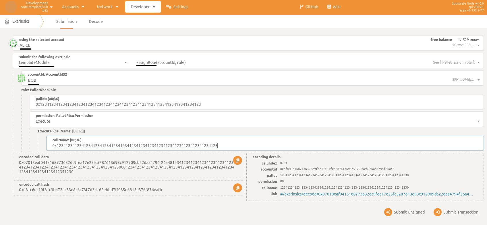
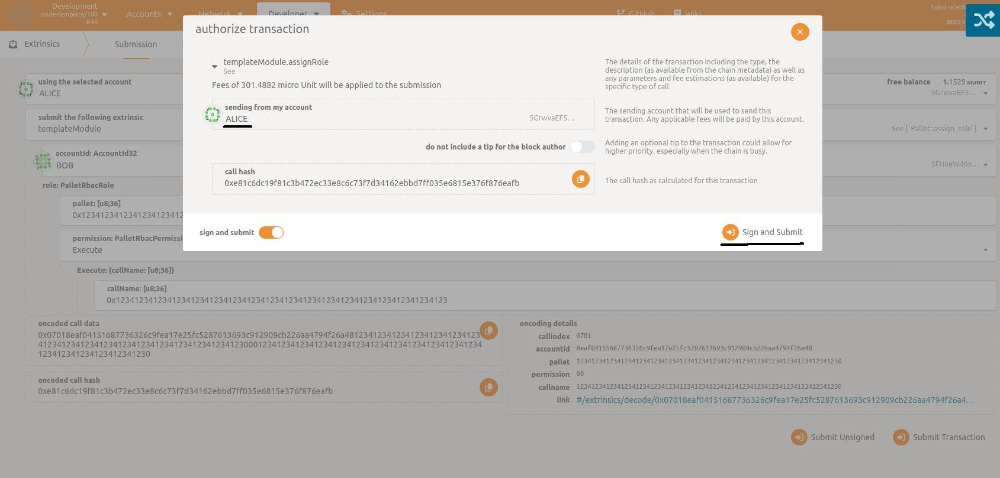
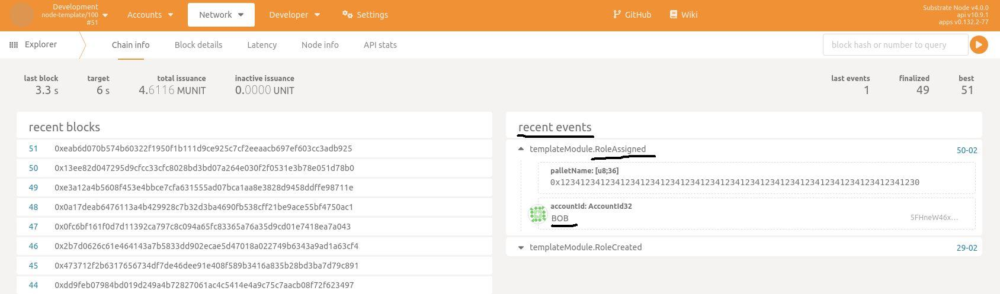

# Role-based Access Control (RBAC) Pallet

The Role-based Access Control (RBAC) pallet is designed to provide a role-based access control mechanism within a Substrate runtime. It enables the definition of roles, assignment of roles to extrinsic calls, association of roles with user accounts, and restriction of extrinsic calls based on assigned roles.

## Table of Contents
- [Features](#features)
- [Usage](#usage)
  - [Defining Roles](#defining-roles)
  - [Assigning Roles to Accounts](#assigning-roles-to-accounts)
  - [Unassigning Roles from Accounts](#unassigning-roles-from-accounts)
  - [Adding a  Global Admin](#adding-a-global-admin)
- [Installation and configuration](#installation-and-configuration)
- [Demo create and assign a role for exrinsic](#demo-create-and-assign-a-role-for-exrinsic)
- [License](#license)

## Features

The RBAC pallet offers the following features:

1. **Role Definition:** Define custom roles within the runtime to represent different levels of access or responsibilities.

2. **Role Assignment:** Assign roles to specific extrinsic calls, allowing fine-grained control over who can execute particular actions.

3. **Account Role Association:** Associate user accounts with roles, providing a way to manage access permissions for individual users.

4. **Extrinsic Call Restriction:** Restrict the execution of extrinsic calls based on the roles associated with the caller's account.

## Usage

### Defining Roles

To define roles using the RBAC pallet, one will need to call `create_role`.

### Assigning Roles to Accounts

To assign roles using the RBAC pallet, one will need to call `assign_role`.

### Unassigning Roles from Accounts

To unassign roles using the RBAC pallet, one will need to call `unassign_role`.

### Adding a  Global Admin

To add a new Global Admin, i.e. an account that has access to all pallets, one will need to call `add_global_admin` using root account

## Installation and configuration

* Add the module's dependency in the `Cargo.toml` of your `runtime` directory. Make sure to enter the correct path or git url of the pallet as per your setup.

```toml
[dependencies.pallet_rbac]
package = 'pallet-rbac'
git = 'https://github.com/tyshkor/pallet-rbac.git'
default-features = false
```

* Declare the pallet in your `runtime/src/lib.rs`.

```rust
pub use pallet_rbac;

impl pallet_rbac::Config for Runtime {
    type Event = Event;
    type RbacAdminOrigin = EnsureRoot<AccountId>;
}

construct_runtime!(
    pub enum Runtime where
        Block = Block,
        NodeBlock = opaque::Block,
        UncheckedExtrinsic = UncheckedExtrinsic
    {
        ...
        ...
        ...
        RBAC: pallet_rbac::{Pallet, Call, Storage, Event<T>, Config<T>},
    }
);
```

* Add the module's `Authorize` type in the `SignedExtra` checklist.

```rust
pub type SignedExtra = (
    ...
    ...
    balances::TakeFees<Runtime>,
    pallet_rbac::Authorize<Runtime>
```

* Add a genesis configuration for the module in the `src/chain_spec.rs` file.

```rust
rbac: Some(RBACConfig {
	global_admins: vec![get_account_id_from_seed::<sr25519::Public>("Alice")]
})
```

* `cargo build --release` and then `cargo run --release -- --dev`

## Demo create and assign a role for exrinsic

1. Navigate to the hosted version of the Polkadot/Substrate Portal front-end by connecting to the local node endpoint using this link: https://polkadot.js.org/apps/#/explorer?rpc=ws://localhost:9944.

2. Go to Extrinsics.



3. Choose `templateModule` and `createRole`.



4. Choose `Alice` as the caller (she is an admin from genesis) and write down the `palletName` and `callName`.



5. Authorize the transaction to finilize it using `Sign and Submit` button.



6. Go to `Network/Explorer` to check that the transaction was successful. Also you can see that the `RoleCreated` event was fired.



7. Let's return to `Extrinsics` to call `assignRole` using `Alice` account to assign `Bob` account `Execute` role for the call. You can see what data you should insert or choose for that. 



8. Authorize the transaction to finilize it using `Sign and Submit` button.



9. Go to `Network/Explorer` to check that the transaction was successful. Also you can see that the `RoleAssigned` event was fired for `Bob` account.



## License

License: MIT-0

---

For more detailed information and code examples, please refer to the official documentation and codebase. Contributions and improvements are welcome!


